# Cache Across America

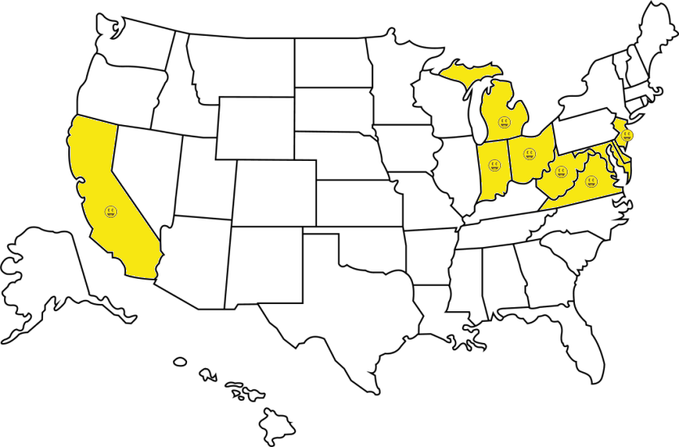
 

### Log entries

| State         | Date                                                        |
| ------------- | ----------------------------------------------------------- |
| California    | [2024-11-16](https://www.geocaching.com/live/log/GL1DCH4YZ) |
| New Jersey    | [2024-12-26](https://www.geocaching.com/live/log/GL1DGP3MN) |
| Delaware      | [2025-05-18](https://www.geocaching.com/live/log/GL1ECDM6V) |
| Maryland      | [2025-05-19](https://www.geocaching.com/live/log/GL1ECHQMW) |
| Virginia      | [2025-05-20](https://www.geocaching.com/live/log/GL1ECRQBE) |
| West Virginia | [2025-05-22](https://www.geocaching.com/live/log/GL1ED1NCN) |
| Indiana       | [2025-07-23](https://www.geocaching.com/live/log/GL1EVJY7F) |
| Michigan      | [2025-07-23](https://www.geocaching.com/live/log/GL1EVT11N) |
| Ohio          | [2025-07-24](https://www.geocaching.com/live/log/GL1EVT2KX) |
| Florida       | [2025-11-24](https://www.geocaching.com/live/log/GL1FMYAA6) |
| Georgia       | [2025-11-27](https://www.geocaching.com/live/log/GL1FN64EA) |
| Alabama       | [2025-11-29](https://www.geocaching.com/live/log/GL1FNCD48) |
| Utah          | [2025-12-22](https://www.geocaching.com/live/log/GL1FR4HRK) |
| Nevada        | [2025-12-23](https://www.geocaching.com/live/log/GL1FR85CT) |

### My journey

#### 2015

I happened to find the original California CAA cache in my first week of
caching. It was located very close to my work at the time. I had no idea what
CAA was. My log was simply "TFTC". Such a neophyte.

#### 2024

I first heard about the CAA series from
[this Reddit thread](https://www.reddit.com/r/geocaching/comments/1g3tla6/mustcache_in_washington_dc_area/),
which listed the series final as a must-do cache in DC. I already had a goal of
finding a cache in every state, but this added an irresistible layer of
difficulty, and a sense of organized curation, to it. I knew I had to get my
name in the hall of fame.

The replacement California cache was fortunately in the Bay Area. I made the
short drive and found the cache in a beautiful park with spectacular views of
the coast. A great way to start the series. I did a long loop with a brutal
uphill climb on the way back. Near the parking lot, there was a medical
emergency on the trail, and I actually saw a very rugged ambulance drive on the
trail to transport the victim away.

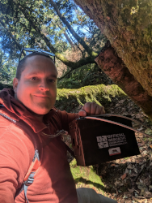
 
California

For Christmas, my family visited my sister in New York City. I knew I wouldn't
have much time to make a long trip, and I didn't have a car of my own, so I made
only one CAA attempt: New Jersey, which is actually the closest CAA cache to
NYC. I made the 2.5 hour (one-way) drive in the dark, but other than some
self-induced GPS problems, I had no issues finding the cache---even though the
only light I had during the search was my phone's flashlight.

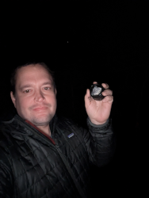
 
New Jersey

#### 2025

Early this year, I decided to attend
[GeoWoodstock XXI](http://geowoodstockxxi.com). As I do whenever I travel, I
looked at what CAA caches were near; WV, VA, and MD were obvious choices. I
booked my flight and began counting the days. About a week later, I realized
that getting these states would isolate Delaware. So I moved my flight up a day
and added the beach to my itinerary. Another while later, I kept thinking about
[GC17MX1](http://coord.info/GC17MX1). It is a 33 stage multi in Central Park,
Manhattan, that I started in 2019. I came very close to finishing it on the
aforementioned trip to NYC for Christmas, but I had some numbers wrong and ran
out of time to try to fix it. I didn't know when I would be back in NYC, so I
went all out and moved my departure another day earlier.

Well, the start of this trip was a comedy of errors. My Friday flight got
cancelled. My rebooked flight the next day was delayed. Despite Google Maps's
insistence, it is impossible to drive to the EWR Amtrak station, so I had to
drive to a different train station to catch my train. That train got delayed 40
minutes due to a disabled train on the tracks. On the drive to Delaware, Google
Maps had me avoid traffic by taking a side street, only to find that the ramp
back onto the highway was closed so I had to backtrack back to the highway, then
sit in that traffic. Nevertheless, after a three-and-a-half hour train ride and
a three hour drive, I found myself on Bethany Beach within easy walking distance
of the New Jersey cache.

Or so I thought. Google Maps once again routed me to the wrong place, this time
a private development. I looked for the parking waypoint that the cache
description mentioned, but it was not the be found. I finally used the parking
waypoint for [GC5A05G](http://coord.info/GC5A05G) and walked the 2.5 miles round
trip to sign the log.

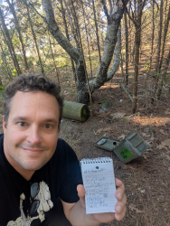
 
Delaware

The next day took me through Maryland into West Virginia. The Maryland cache was
thankfully uneventful. I was worried it would be difficult to find in the woods
without a hint, but my GPSr was surprisingly reliable.

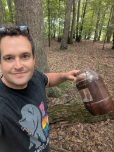
 
Maryland

After a drive through Shenandoah National Park, I continued on to Richmond for
the Virginia cache. This was the most disappointing CAA cache I had encountered
up to this point, because this location had so much potential to be great, but
was unfortunately ruined by the local residents. The natural beauty of the
island and river were marred by ubiquitous graffiti. The sound of the rushing
water was drowned out by amplified music. To top it off, the south parking
waypoint has been turned into resident-only parking, so I needed to search for a
place to park. I was sad that I felt I should leave quickly instead of staying
to enjoy the unique location.

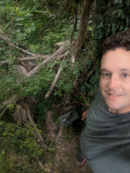
 
Virginia

All told, I drove 650 miles in two days to get MD, VA, one national park, and to
set myself up for another national park the next day. After a few stops at New
River Gorge NP, I continued on to Morgantown. I arrived too late to go to
Cooper's Rock State Forest. The next day was very rainy, making me regret not
arriving early enough yesterday to make an attempt. I began the day by attending
the pre-GeoWoodstock event in the same park. I ran into problems as soon as I
started the hike. First, I took the wrong trail. I ended up on the McCollum
trail, which isn't even on Google Maps. After I crossed the power lines, I
checked the map, and realized I was way off. I followed a faint trail back
towards the Raven Rock trail, but it soon ended. I cut through about 300 yards
of off-trail wilderness to get back to Raven Rock. From then, I encountered
muddy ground and running water on the trail at times. Then it started to really
pour. The rain soaked through my shoes, hat, pants, and even my old raincoat.
This all made the hike seem much longer than it was. However I found the
container easily, took in the views from the nearby vantage point, and began the
trek back to my car. The hike back never seems as long as the hike out.

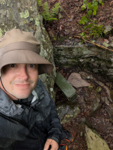
 
West Virginia

Four CAA caches in five days--the year is off to a great start. Can it get even
better though?

Two months after returning from GeoWoodstock, I made plans to visit Indianapolis
to attend the Post. music festival and see a band I had been trying to see
perform live for ten years. After lots of route finding, I figured the best path
was to fly into Chicago, visit Indiana Dunes NP, pick up the Indiana and
Michigan CAA caches, and then stay with a relative in Ohio. And that's pretty
much how the first day worked out. Indiana was a fun hide that stumped me for
several minutes.

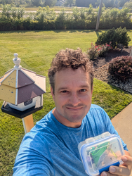
 
Indiana

Michigan was a little bit more of an adventure, since I chose to walk along the
road to get from the parking waypoint to GZ. I had to hop a wire fence to get to
the container. Then, staying on that side, I had to hop another wire fence to
get back to my car. It was a very pretty sunset though.

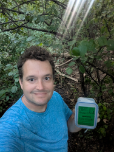
 
Michigan

I had initially planned to get Ohio and Kentucky the next day. However, I needed
to catch up on sleep (my flight the previous day was very early) and dipping
into Kentucky would have added 2.5 hours to the trip. I wanted to spend that
time with relatives, and being on the road an extra 2.5 hours would put me in
Indianapolis dangerously close to the start of the festival. I chose to skip
Kentucky and drive straight to Indy after signing the Ohio log. I can neither
confirm nor deny that my choice of shirt, celebrating four consecutive victories
by the University of Michigan Wolverines football team over a university in the
state of Ohio, was intentional.

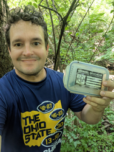
 
Ohio

Three states, two days, 650 miles (again). Would have been nicer to get four,
but I'm still happy.

Later in the year, my wife's family wanted to have a reunion in Atlanta. Our
kids and our nephew had the entire week of Thanksgiving off from school, so they
decided to schedule the reunion for that week. We spent three days in Orlando
before driving up to Atlanta. I managed to get some time away on our first day
in Florida to drive up to Lake Norris while everyone else was recovering and
adjusting to the time difference. Florida is a multi, and stage 1 actually gave
me quite a bit of trouble, because I didn't know what I was looking for. It
didn't help that the coords pointed to a different object. I finally found it
using the hint, but I read the wrong number of digits. This led me to a
plausible but unlikely place. After a cursory investigation, I determined I was
in the wrong place and headed back into the Lake Norris conservation area. I was
able to drive to stage 2, which I was grateful for, since it was a little humid.
Stage 2 was a quick find, and 3 the quickest because of the hint. The GPSr was a
little jumpy at the final, but I used a previous log photo to narrow my search.
This was the hardest I've worked for a CAA cache so far, but I enjoyed the
experience.

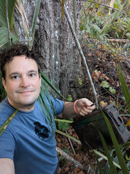
 
Florida

We split up the drive from Orlando to Atlanta over two days. On the second day,
we made the detour to pick up Georgia. It was a lot like Maryland (except I was
able to park much closer): in the woods, no hint, but still a quick find.

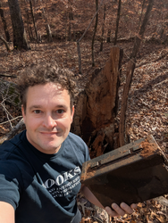
 
Georgia

Two days after Thanksgiving, I set out at 6:00 a.m. I was surprised to encounter
Atlanta traffic at 6:15 on a Saturday morning, but if anything has surprised me
about this trip, it's been the traffic. The thing that has surprised me the
second most is the weather. I expected Florida to be hot and humid, but I did
not expect Atlanta, just a few hours north, to be so cold, and Alabama to be
below freezing. I arrived at Cheaha State Park before it opened, but the gate
was open and I drove through. (I did the honorable thing of paying on my way
out). The gate to Bald Rock was closed, despite the sign saying it would be open
at sunrise. I walked past and made my way along the long wooden walkway. Once I
got to the end, I began my search. I don't know what is the intended route to
the final, but the path I took earned all of its 2.5 terrain stars, if not more.
Once I got relatively close, there was a tree that stood out, and sure enough
that was the one which housed the cache. I signed my name and began the trek
back. This time I found what is likely the intended path (funny how that always
happens. I think it's because when going to GZ, the only measure of progress is
distance away and one is reluctant to make any adjustment that deviates from the
direct path. Once the cache is found, the goal now becomes a safe return to a
known location).

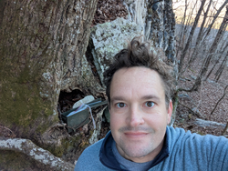
 
Alabama

For Christmas, my wife and older son went to Korea, leaving me and my younger son to fend for ourselves. I asked him what he wanted to do.

"I want to go to Death Valley."

My heart melted and a trip was planned. We will drive to Las Vegas, spend 4-5 days there, then 1-2 days in Death Valley, then swing past Mono Lake on the way back. Caching-wise, my goals are seven counties in my quest to sign a log in all 58 in CA, GCC2, and the Nevada and Utah C