<!-- title also in _config.yml -->

# bitlux's Cache Across America Journal

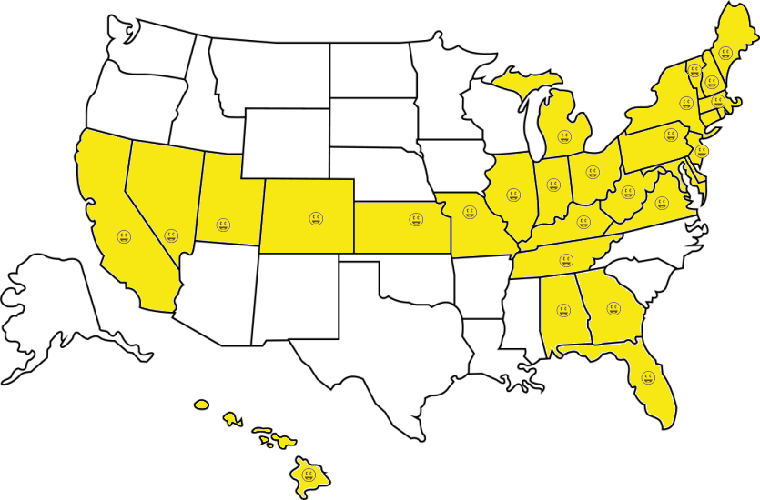
 

## Log entries

| State         | Date                                                        |
| ------------- | ----------------------------------------------------------- |
| California    | [2024-11-16](https://www.geocaching.com/live/log/GL1DCH4YZ) |
| New Jersey    | [2024-12-26](https://www.geocaching.com/live/log/GL1DGP3MN) |
| Delaware      | [2025-05-18](https://www.geocaching.com/live/log/GL1ECDM6V) |
| Maryland      | [2025-05-19](https://www.geocaching.com/live/log/GL1ECHQMW) |
| Virginia      | [2025-05-20](https://www.geocaching.com/live/log/GL1ECRQBE) |
| West Virginia | [2025-05-22](https://www.geocaching.com/live/log/GL1ED1NCN) |
| Indiana       | [2025-07-23](https://www.geocaching.com/live/log/GL1EVJY7F) |
| Michigan      | [2025-07-23](https://www.geocaching.com/live/log/GL1EVT11N) |
| Ohio          | [2025-07-24](https://www.geocaching.com/live/log/GL1EVT2KX) |
| Florida       | [2025-11-24](https://www.geocaching.com/live/log/GL1FMYAA6) |
| Georgia       | [2025-11-27](https://www.geocaching.com/live/log/GL1FN64EA) |
| Alabama       | [2025-11-29](https://www.geocaching.com/live/log/GL1FNCD48) |
| Utah          | [2025-12-22](https://www.geocaching.com/live/log/GL1FR4HRK) |
| Nevada        | [2025-12-23](https://www.geocaching.com/live/log/GL1FR85CT) |
| Hawaii        | [2026-04-16](https://www.geocaching.com/live/log/GL1GB5Y7F) |
| Tennessee     | [2026-07-03](https://www.geocaching.com/live/log/GL1GVV6AM) |
| Kentucky      | [2026-07-03](https://www.geocaching.com/live/log/GL1GVV6VK) |
| Colorado      | [2026-09-26](https://www.geocaching.com/live/log/GL1HDRDNR) |
| Kansas        | [2026-09-27](https://www.geocaching.com/live/log/GL1HE3P6K) |
| Missouri      | [2026-09-27](https://www.geocaching.com/live/log/GL1HE3QFC) |
| Illinois      | [2026-09-28](https://www.geocaching.com/live/log/GL1HE8X84) |
| Connecticut   | [2026-09-29](https://www.geocaching.com/live/log/GL1HEEFGK) |
| Rhode Island  | [2026-09-29](https://www.geocaching.com/live/log/GL1HEEFMY) |
| Massachusetts | [2026-09-30](https://www.geocaching.com/live/log/GL1HEJKHN) |
| New Hampshire | [2026-09-30](https://www.geocaching.com/live/log/GL1HEJM61) |
| Vermont       | [2026-09-30](https://www.geocaching.com/live/log/GL1HEJMNV) |
| Maine         | [2026-09-30](https://www.geocaching.com/live/log/GL1HEKDC1) |
| New York      | [2026-10-01](https://www.geocaching.com/live/log/GL1HEQR1J) |
| Pennsylvania  | [2026-10-02](https://www.geocaching.com/live/log/GL1HEWFEQ) |

## My journey

### 2015

I happened to find the original California CAA cache in my first week of
caching. It was located very close to my work at the time. I had no idea what
CAA was. My log was simply "TFTC". Such a neophyte.

### 2024

I first heard about the CAA series from
[this Reddit thread](https://www.reddit.com/r/geocaching/comments/1g3tla6/mustcache_in_washington_dc_area/),
which listed the series final as a must-do cache in DC. I already had a goal of
finding a cache in every state, but this added an irresistible layer of
difficulty, and a sense of organized curation, to it. I knew I had to get my
name in the hall of fame.

The replacement California cache was fortunately in the Bay Area. I made the
short drive and found the cache in a beautiful park with spectacular views of
the coast. A great way to start the series. I did a long loop with a brutal
uphill climb on the way back. Near the parking lot, there was a medical
emergency on the trail, and I actually saw a very rugged ambulance drive on the
trail to transport the victim away.

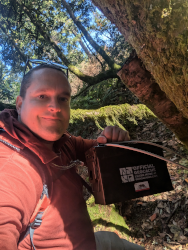
 
California

For Christmas, my family visited my sister in New York City. I knew I wouldn't
have much time to make a long trip, and I didn't have a car of my own, so I made
only one CAA attempt: New Jersey, which is actually the closest CAA cache to
NYC. I made the 2.5 hour (one-way) drive in the dark, but other than some
self-induced GPS problems, I had no issues finding the cache---even though the
only light I had during the search was my phone's flashlight.

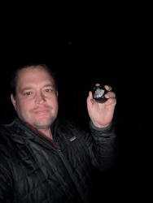
 
New Jersey

### 2025

Early this year, I decided to attend
[GeoWoodstock XXI](http://geowoodstockxxi.com). As I do whenever I travel, I
looked at what CAA caches were near; WV, VA, and MD were obvious choices. I
booked my flight and began counting the days. About a week later, I realized
that getting these states would isolate Delaware. So I moved my flight up a day
and added the beach to my itinerary. Another while later, I kept thinking about
[GC17MX1](http://coord.info/GC17MX1). It is a 33 stage multi in Central Park,
Manhattan, that I started in 2019. I came very close to finishing it on the
aforementioned trip to NYC for Christmas, but I had some numbers wrong and ran
out of time to try to fix it. I didn't know when I would be back in NYC, so I
went all out and moved my departure another day earlier.

Well, the start of this trip was a comedy of errors. My Friday flight got
canceled. My re-booked flight the next day was delayed. Despite Google Maps's
insistence, it is impossible to drive to the EWR Amtrak station, so I had to
drive to a different train station to catch my train. That train got delayed 40
minutes due to a disabled train on the tracks. On the drive to Delaware, Google
Maps had me avoid traffic by taking a side street, only to find that the ramp
back onto the highway was closed so I had to backtrack back to the highway, then
sit in that traffic. Nevertheless, after a three-and-a-half hour train ride and
a three hour drive, I found myself on Bethany Beach within easy walking distance
of the Delaware cache.

Or so I thought. Google Maps once again routed me to the wrong place, this time
a private development. I looked for the parking waypoint that the cache
description mentioned, but it was not the be found. I finally used the parking
waypoint for [GC5A05G](http://coord.info/GC5A05G) and walked the 2.5 miles round
trip to sign the log.

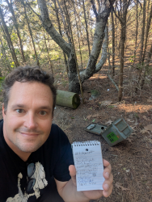
 
Delaware

The next day took me through Maryland into West Virginia. The Maryland cache was
thankfully uneventful. I was worried it would be difficult to find in the woods
without a hint, but my GPSr was surprisingly reliable.

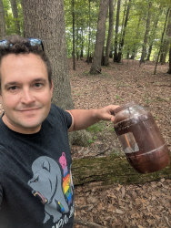
 
Maryland

After a drive through Shenandoah National Park, I continued on to Richmond for
the Virginia cache. This was the most disappointing CAA cache I had encountered
up to this point, because this location had so much potential to be great, but
was unfortunately ruined by the local residents. The natural beauty of the
island and river were marred by ubiquitous graffiti. The sound of the rushing
water was drowned out by amplified music. To top it off, the south parking
waypoint has been turned into resident-only parking, so I needed to search for a
place to park. I was sad that I felt I should leave quickly instead of staying
to enjoy the unique location.

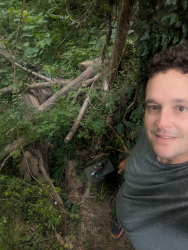
 
Virginia

All told, I drove 650 miles in two days to get MD, VA, one national park, and to
set myself up for another national park the next day. After a few stops at New
River Gorge NP, I continued on to Morgantown. I arrived too late to go to
Cooper's Rock State Forest. The next day was very rainy, making me regret not
arriving early enough yesterday to make an attempt. I began the day by attending
the pre-GeoWoodstock event in the same park. I ran into problems as soon as I
started the hike. First, I took the wrong trail. I ended up on the McCollum
trail, which isn't even on Google Maps. After I crossed the power lines, I
checked the map, and realized I was way off. I followed a faint trail back
towards the Raven Rock trail, but it soon ended. I cut through about 300 yards
of off-trail wilderness to get back to Raven Rock. From then, I encountered
muddy ground and running water on the trail at times. Then it started to really
pour. The rain soaked through my shoes, hat, pants, and even my old raincoat.
This all made the hike seem much longer than it was. However I found the
container easily, took in the views from the nearby vantage point, and began the
trek back to my car. The hike back never seems as long as the hike out.

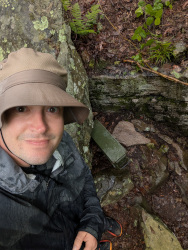
 
West Virginia

Four CAA caches in five days--the year is off to a great start. Can it get even
better though?

Two months after returning from GeoWoodstock, I made plans to visit Indianapolis
to attend the Post. music festival and see a band I had been trying to see
perform live for ten years. After lots of route finding, I figured the best path
was to fly into Chicago, visit Indiana Dunes NP, pick up the Indiana and
Michigan CAA caches, and then stay with a relative in Ohio. And that's pretty
much how the first day worked out. Indiana was a fun hide that stumped me for
several minutes.

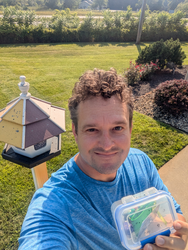
 
Indiana

Michigan was a little bit more of an adventure, since I chose to walk along the
road to get from the parking waypoint to GZ. I had to hop a wire fence to get to
the container. Then, staying on that side, I had to hop another wire fence to
get back to my car. It was a very pretty sunset though.

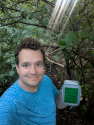
 
Michigan

I had initially planned to get Ohio and Kentucky the next day. However, I needed
to catch up on sleep (my flight the previous day was very early) and dipping
into Kentucky would have added 2.5 hours to the trip. I wanted to spend that
time with relatives, and being on the road an extra 2.5 hours would put me in
Indianapolis dangerously close to the start of the festival. I chose to skip
Kentucky and drive straight to Indy after signing the Ohio log. I can neither
confirm nor deny that my choice of shirt, celebrating four consecutive victories
by the University of Michigan Wolverines football team over a university in the
state of Ohio, was intentional.

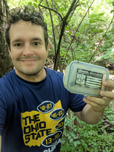
 
Ohio

Three states, two days, 650 miles (again). Would have been nicer to get four,
but I'm still happy.

Later in the year, my wife's family wanted to have a reunion in Atlanta. Our
kids and our nephew had the entire week of Thanksgiving off from school, so they
decided to schedule the reunion for that week. We spent three days in Orlando
before driving up to Atlanta. I managed to get some time away on our first day
in Florida to drive up to Lake Norris while everyone else was recovering and
adjusting to the time difference. Florida is a multi, and stage 1 actually gave
me quite a bit of trouble, because I didn't know what I was looking for. It
didn't help that the coords pointed to a different object. I finally found it
using the hint, but I read the wrong number of digits. This led me to a
plausible but unlikely place. After a cursory investigation, I determined I was
in the wrong place and headed back into the Lake Norris conservation area. I was
able to drive to stage 2, which I was grateful for, since it was a little humid.
Stage 2 was a quick find, and 3 the quickest because of the hint. The GPSr was a
little jumpy at the final, but I used a previous log photo to narrow my search.
This was the hardest I've worked for a CAA cache so far, but I enjoyed the
experience.

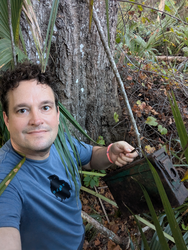
 
Florida

We split up the drive from Orlando to Atlanta over two days. On the second day,
we made the detour to pick up Georgia. It was a lot like Maryland (except I was
able to park much closer): in the woods, no hint, but still a quick find.

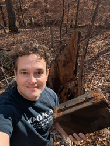
 
Georgia

Two days after Thanksgiving, I set out at 6:00 a.m. I was surprised to encounter
Atlanta traffic at 6:15 on a Saturday morning, but if anything has surprised me
about this trip, it's been the traffic. The thing that has surprised me the
second most is the weather. I expected Florida to be hot and humid, but I did
not expect Atlanta, just a few hours north, to be so cold, and Alabama to be
below freezing. I arrived at Cheaha State Park before it opened, but the gate
was open and I drove through. (I did the honorable thing of paying on my way
out). The gate to Bald Rock was closed, despite the sign saying it would be open
at sunrise. I walked past and made my way along the long wooden walkway. Once I
got to the end, I began my search. I don't know what is the intended route to
the final, but the path I took earned all of its 2.5 terrain stars, if not more.
Once I got relatively close, there was a tree that stood out, and sure enough
that was the one which housed the cache. I signed my name and began the trek
back. This time I found what is likely the intended path (funny how that always
happens. I think it's because when going to GZ, the only measure of progress is
distance away and one is reluctant to make any adjustment that deviates from the
direct path. Once the cache is found, the goal now becomes a safe return to a
known location).

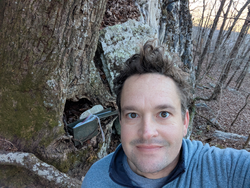
 
Alabama

For Christmas, my wife and older son went to Korea, leaving me and my younger
son without plans. My wife asked him, "Do you want to come to Korea with us?"
 
"No." 
I asked him, "Do you want to go to NYC with grandma and your aunt?" 
"No." 
"Well, where do you want to go?" 
"I want to go to Death Valley."

My heart melted and a boys road trip was planned. We spent almost a week in Las
Vegas and made the 2.5 hour drive to the Utah cache on our second day, before a
brief visit to Zion National Park.

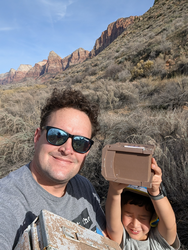
 
Utah

I had toyed with the idea of getting two CAA caches in the same day for the
second time this year, but the early sunset made me realize this was a bad idea.
The next afternoon we set out for a hike in Red Rock Canyon, a short drive from
Vegas, on a surprisingly cloudy day. We even got rain on our drive back.

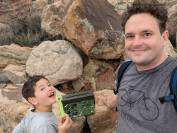
 
Nevada

### 2026

After a long deliberation about where to go for the kids' spring break, we
settled on Hawai'i. I made sure the trip included a few days in Oahu so I could
attempt this cache. I woke up early one morning and made the drive to Keaīwa
Heiau State Recreation Area (somehow there was traffic in Honolulu at 6:30
a.m.). After a short but gorgeous hike and a quick search I found the container.
I awarded the cache a favorite point for the scenery.

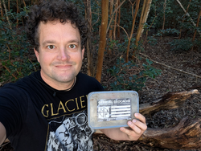
 
Hawai'i

Fast forward to the middle of summer. My older son was spending four weeks at
camps in Pittsburgh, PA, and I needed to go pick him up. By now you know the
routine: how can I extend this trip to get as many CAAs as reasonable? At
first I wasn't sure how much time I would be able to allocate to this trip; 
at one point I even considered flying to as far away from my destination as
Texas and driving all the way from there. In the end I had enough time to
spend a day attempting Tennessee and Kentucky before arriving in Pittsburgh
the next day.

Being a "car guy", I reserved a fancy car (as close to a sports car as a
national chain would carry) from the rental place. When I arrived in Nashville, I
got a notification that my Jeep Grand Cherokee was ready. This was not quite
what I had in mind, so I went to the rental counter to see if there were other
options, or if not, if I could at least get a refund. After searching for a
while, the attendant said they had a Genesis available. "I'll take it", I said.
Only after I started the car did I realize it was an entirely electric vehicle,
and the attendant had not told me. By now it was 2:00 a.m., the counter was
closed, and I had 500 miles to drive the next day. I went to the hotel, got a
few hours of sleep, and went to the closest branch of said chain the next day.
The window was open, but no one came to the desk after ten minutes. "Well", I
figured, "this is the kind of challenge that makes for a good story in the end.
Let's see what happens". After researching how to charge the car, I set out for
the Tennessee CAA. Other than the oppressive heat and humidity, I had no trouble
with it.

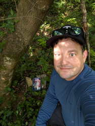
 
Tennessee

After a nice stop at the National Corvette Museum, where I charged my car (it
felt kind of strange bringing an EV to a muscle car mecca), I soon arrived at
the park where the Kentucky cache is. I missed the turn-in to the parking
waypoint, so I parked quasi-legally to retrieve this one.

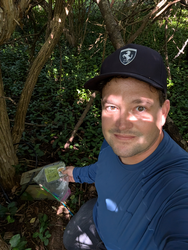
 
Kentucky

Another year, another music festival. This year's was in Brooklyn, which I
figured would give me a good opportunity to find New York, Pennsylvania, and
all of New England. I determined that the shortest path would be to fly
into Hartford, CT, drive for two days to get seven states, attend the first day
of the festival, and then make a trip just for PA on the morning of the second
day of the festival.

Some time after I made that plan, I got the idea to add a prologue of four
Midwest states, to take full advantage of the time that I had as well as to
log two caches hidden in 2000 that I needed for my Jasmer grid. This order of
planning became important later.

In late September, I flew into Denver at night and in the morning drove to the
base of Pikes Peak for the CAA.

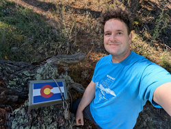
 
Colorado

I then continued on to Kansas to log [Mingo](https://coord.info/GC30). The next
day, I found the Kansas CAA, which was probably my second favorite cache of the
trip. It was on top of a scenic hill, belying the myth that Kansas is perfectly
flat.

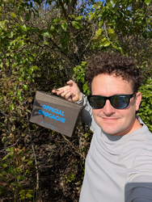
 
Kansas

I found [GC37](https://coord.info/GC37) just after crossing into Missouri.
Continuing on to the CAA, halfway through a 475 mile day that followed a 530 mile
day, I started to have some second thoughts.
I realized that my previous road trips either constrained the driving to no more
than two consecutive days or involved traveling companions.
Going solo on this trip allowed me to travel at my own (ambitious) pace, but
the going was getting tedious and tiring. I really did not respect how much of
the country was, well, countryside. Nevertheless, I was able to keep to
my schedule and find all the caches without difficulty, so I just kept trucking
along.

Missouri's CAA seemed like it was in a random location, but it was a pleasant
surprise to see it was the childhood home of Walt Disney. I was able to read
about his Dreaming Tree and Son of Dreaming Tree without another soul around.

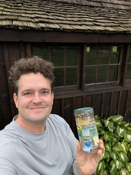
 
Missouri

<fieldset style="width: 80%; margin:0 auto 1em; background: #eee;
border: thin solid black; padding-bottom: 0">

<legend style="font-weight:bold; background: #eee; border:
thin solid black; padding: .2em .6em">Aside: Location selection</legend>

Between the hours spent planning and driving this journey,
I've frequently wondered what goes into a CAA CO's decision of
what location they chose to represent their state.
Some locations are obvious (many are in state capitals), others are a
mystery until I arrive (like Missouri), and some elude me entirely.
It's a difficult task; the New York CAA description lists some of the desiderata
for location selection and how few places actually meet them.

When I first started this series, I had assumed the caches would highlight the
most popular or unique areas of each state. For instance, as someone who enjoys
urban settings, I would have assumed that New York's CAA would be in Manhattan.
As my journey has progressed, though, I began to realize that the series instead
tends to highlight the hidden gems of each state, taking finders to places they
never would have known about otherwise. In that sense, the series is
more "American" that just a list of tourism destinations, it's a cross-section
of the lives of most Americans.
</fieldset>

The next day I made a quick find of Illinois and then continued on to Indianapolis
to catch a plane to Connecticut the following day.

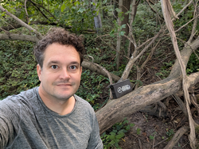
 
Illinois

It was then that I realized that when I planned the second leg of this trip,
I had assumed I would be taking a red-eye to Connecticut and would have the
whole next day to drive around. The itinerary called for four CAAs in one day, a
feat that surely only a handful of people have done. However, with a very early
morning to catch the flight, and said flight landing at 2 p.m., I would not be
able to stick to this schedule. I had somewhat anticipated this though, by not
booking any hotels in advance. My plan was to push as far as I could and
then find the nearest place to sleep. I made the short drive to the Connecticut
CAA, where I was greeted with some interesting history, high humidity, and a
swarm of mosquitoes.

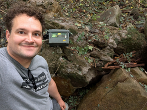
 
Connecticut

90 minutes later, after a short but enjoyable hike, I found the Rhode Island
cache. This trend would continue: all of the CAAs I found on the second leg
(except Maine) involved hikes in the woods.

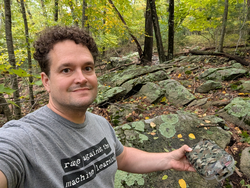
 
Rhode Island

The original plan called for continuing to Massachusetts, then New Hampshire,
then into Maine to spend the night.
However, I wouldn't be able to make it to Concord, MA before nightfall, and I
was not going to attempt the hike to the CAA in the dark.
I found a hotel close to Concord so that I could get an early start the next
day.

The next morning, I hiked through the foggy scenery to find Massachusetts and
then spent a little time in wonderful downtown Concord.

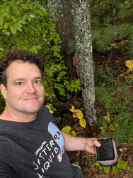
 
Massachusetts

New Hampshire was next, my favorite cache of the trip at the end of the longest,
prettiest hike.

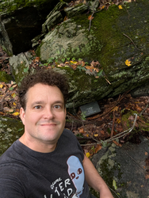
 
New Hampshire

At this point, I was about half a day behind schedule.
If I had kept following the original itinerary, my next stop would be the Maine
CAA.
However, I also wanted to see Acadia National Park, and I would not be able to
reach that before nightfall.
Delaying Acadia to tomorrow would only put me further behind schedule, so I
decided to deviate from the plan.
I wanted to pack as much into this day as I could.
This meant swapping Vermont (which was scheduled for tomorrow) and Maine, so I
could wake up the next day, see Acadia, and then drive straight to Albany, NY.
This would also give me a shot at my goal of four CAAs in one day! I sped
north, through some breathtakingly gorgeous autumn foliage. Vermont was
slightly difficult, as the trail isn't on Google Maps (fortunately c:geo
supports several different maps, including offline ones I had saved a long time
ago) and my GPSr was pointing me tens of feet away from GZ. Nonetheless, I
was able to quickly log and get back on the road.

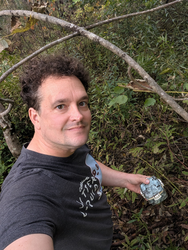
 
Vermont

I arrived in Augusta, ME just before 9 p.m. This was one of the two caches 
on this trip that concerned me, because it had gone missing earlier in the month.
Thankfully, (1) the CO was quick with the replacement (and with responding to
messages), and (2) I was able to find a great place to park.
Still, I spent a good ten minutes searching with phone flashlight (note to self:
always bring a real flashlight if you plan on caching) before finding the
container.
I had done it!
Four in a single day!
And not the four closest to each other, either.
It's very lucky that this was the only CAA that did NOT involve a hike,
otherwise I would not have been able to manage this feat.

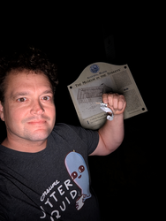
 
Maine

The next day, I visited Acadia National Park as planned (it was incredibly
crowded, even on a Thursday) and then drove to Albany for the CAA, complete with
slugs on the container.

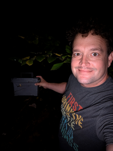
 
New York

Due to the absurd amount of driving I had done this day, I had almost caught
up to my original schedule, which called for me to end the day in the Bronx.
However, I would have arrived after my host was asleep, so at this point I had a
choice to make. I could get a hotel where I was. I could drive closer to NYC.
Or I could get _really_ ambitious.
My original plan was for me to spend all of Friday in NYC, so I would have time
to settle before attending the first day of the music festival that evening, then
drive three hours to the PA CAA cache on Saturday morning, then turn around and
drive back to NYC for the second day of the festival.
Since I wasn't going to be in NYC on Friday morning anyways, what if I found PA
on Friday instead of Saturday?
I decided to go for it and drove two hours to Binghamton, putting me at around
650 miles for the day.

The next day was unquestionably the moment of truth for the entire trip. PA was
the other cache that concerned me, because logs said it was a long, difficult,
boggy bushwhack with inaccurate coordinates. Would I even be able to find this
cache? Would I then be able to drive the three hours to NYC in time to take a
1.5 hour subway ride to Brooklyn? Why oh why couldn't this cache be in Pittsburgh,
the city where I grew up and still have family, where I visit every year? I put
these questions behind me and just focused on what I needed to do.
The first part of the hike was surprisingly easy and made me wonder if this
find could be easier than logs had led me to believe.
However, any semblance of a game trail soon ended, and I had no idea of how to
proceed.
I waded through thorns, hopped over logs, stepped in only one puddle, and went
around in circles, until I ended up at the point where previous logs told me to
go.
Here, I didn't see anything.
I then started looking at photos from logs to see if there were any landmarks
I could recognize.
I did notice a double-trunk tree appeared in a lot of photos and I saw one of
those nearby so I walked over to it.
I circled and circled but I didn't see anything.
Running out of ideas, I looked around again and saw a different double-trunk
tree about 30 feet further away from GZ. Right at its base was a large ammo can.
Finally!
All in all it took me about 45 minutes from parking to signing the log and then
another 10 minutes to walk back to my car.

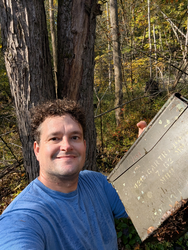
 
Pennsylvania

This ended the main caching portion of what I had come to call my
"indeterminable, insane trip" (because "long, strange trip" was already taken).
I drove to NYC, attended the festival, and logged a few more caches
in the Bronx and Manhattan before returning to California.
Seven days, 12 CAAs, 2700 miles driven, many lessons learned (be ambitious yet
flexible, bring a flashlight).

I fear my progress going forward will be significantly slower than the whirlwind
of the past two years. Most of the remaining states I have not even visited yet.
It's going to be hard to convince the family to visit places that don't have
attractions nearby. Yet, somehow I've made it work so far, so I'm hoping I can
presernve the momentum.
